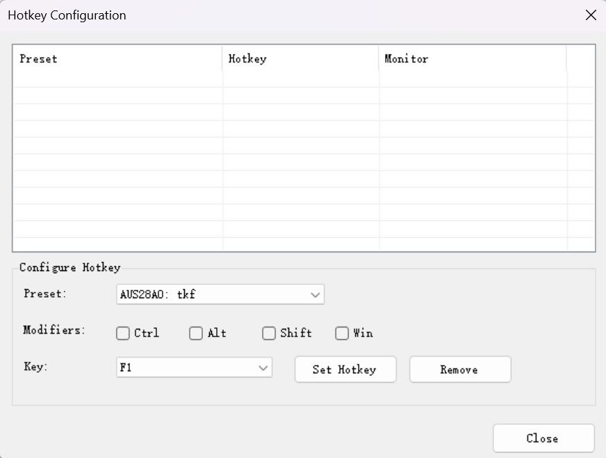

# Gamma Manager - Hotkey Edition

[English](#english) | [中文](#中文) | [Русский](#русский)

---

## English

### Overview

Gamma Manager is a powerful display color management tool with global hotkey support. No installation required - just run the .exe file. Settings are automatically saved to a .ini file in the same folder.

### Key Features

#### ✨ Global Hotkey Support
- **Quick adjustments** via customizable keyboard shortcuts
- **System-wide hotkeys** work even when the app is minimized
- **Visual feedback** in system tray when hotkeys are triggered
- **Persistent settings** saved automatically

**How to use hotkeys:**
1. Create a preset first (save your preferred settings)
2. Right-click the Gamma Manager icon in system tray
3. Select "Hotkey Configuration" to manage and add hotkeys
4. Assign keyboard shortcuts to your presets

#### 📊 Advanced Color Controls
- **Gamma** adjustment: 0.30 — 4.40 (default: 1.00)
- **Brightness** adjustment: -1.00 — 1.00 (default: 0.00)
- **Contrast** adjustment: 0.10 — 3.00|100.00 (default: 1.00)
- **RGB independent control** via color buttons
- **Extreme contrast mode** (toggle []+++ checkbox for 0.10-100.00 range)

#### 💻 Direct Numeric Input
- **Click any value box** next to sliders to enter precise numbers
- **Support for both comma and period** as decimal separators (1.5 or 1,5)
- **Real-time validation** with automatic range clamping
- **Press Enter** to apply the value immediately

#### 🖥️ Multi-Monitor Support
- Control multiple monitors independently
- Hardware brightness/contrast control (0-100, if supported by monitor)
- Quick monitor switching with "Forward" button or mouse wheel

#### 💾 Preset Management
- Save unlimited presets with custom names
- Quick access from system tray dropdown menu
- Easy preset switching with mouse wheel
- Delete unwanted presets anytime

### Usage

#### Basic Operations
- **Slider adjustment**: Drag the slider, use keyboard arrows, or click on either side
- **Fine-tuning**: Use numeric input boxes for precise control
- **Reset**: Return all values to defaults (Gamma 1.00, Brightness 0.00, Contrast 1.00)
- **Hide**: Minimize to system tray (double-click tray icon to restore)

#### Monitor Control
- **Monitor selection**: Use dropdown list, mouse wheel, or "Forward" button
- **Hardware controls**: Adjust monitor brightness/contrast (DDC/CI compatible monitors only)

#### Preset Workflow
1. Adjust colors to your preference
2. Enter a name in the preset list
3. Click "Save" to store in .ini file
4. Access presets from main window or tray icon
5. (Optional) Assign hotkeys for instant switching

### System Requirements
- Windows 10/11 (or Windows 7+ with .NET Framework 4.7.2)
- No installation required
- Optional: Administrator rights for DDC/CI hardware control

### Download

Available builds for all platforms:
- **Gamma.Manager.x86.exe** - For 32-bit systems (maximum compatibility)
- **Gamma.Manager.x64.exe** - For 64-bit systems (recommended for most users)
- **Gamma.Manager.ARM64.exe** - For ARM processors (Surface Pro X, Snapdragon laptops)

### Technical Notes
- Uses Windows GDI `SetDeviceGammaRamp` API
- DDC/CI protocol for hardware monitor control
- Settings stored in `GammaManager.ini` (same folder as executable)
- Hotkey settings persist across sessions

---

## 中文

### 概述

Gamma Manager 是一款强大的显示器色彩管理工具，支持全局快捷键。无需安装，直接运行 .exe 文件即可。设置会自动保存到同目录下的 .ini 文件。

### 主要功能

#### ✨ 全局快捷键支持
- **快速调整**：通过自定义键盘快捷键
- **系统级热键**：即使应用最小化也能使用
- **视觉反馈**：热键触发时在系统托盘显示提示
- **持久化设置**：自动保存配置

**如何使用快捷键：**
1. 首先创建一个预设（保存你喜欢的设置）
2. 右键点击系统托盘中的 Gamma Manager 图标
3. 选择"Hotkey Configuration"来管理和添加快捷键
4. 为你的预设分配键盘快捷键

#### 📊 高级色彩控制
- **Gamma（伽马）** 调整：0.30 — 4.40（默认：1.00）
- **Brightness（亮度）** 调整：-1.00 — 1.00（默认：0.00）
- **Contrast（对比度）** 调整：0.10 — 3.00|100.00（默认：1.00）
- **RGB 独立控制**：通过颜色按钮
- **极限对比度模式**：勾选 []+++ 复选框启用 0.10-100.00 范围

#### 💻 直接数值输入
- **点击滑动条旁的文本框**输入精确数值
- **支持逗号和点号**作为小数分隔符（1.5 或 1,5）
- **实时验证**：自动限制到有效范围
- **按回车键**立即应用数值

#### 🖥️ 多显示器支持
- 独立控制多个显示器
- 硬件亮度/对比度控制（0-100，需显示器支持）
- 使用"Forward"按钮或鼠标滚轮快速切换显示器

#### 💾 预设管理
- 保存无限数量的自定义预设
- 从系统托盘下拉菜单快速访问
- 使用鼠标滚轮轻松切换预设
- 随时删除不需要的预设

### 使用方法

#### 基本操作
- **滑动条调整**：拖动滑块、使用键盘方向键或点击两侧
- **精细调整**：使用数值输入框进行精确控制
- **重置**：将所有值恢复为默认（Gamma 1.00、Brightness 0.00、Contrast 1.00）
- **隐藏**：最小化到系统托盘（双击托盘图标恢复）

#### 显示器控制
- **显示器选择**：使用下拉列表、鼠标滚轮或"Forward"按钮
- **硬件控制**：调整显示器亮度/对比度（仅兼容 DDC/CI 的显示器）

#### 预设工作流程
1. 调整颜色到你喜欢的效果
2. 在预设列表中输入名称
3. 点击"Save"保存到 .ini 文件
4. 从主窗口或托盘图标访问预设
5. （可选）为预设分配快捷键以实现即时切换

### 系统要求
- Windows 10/11（或 Windows 7+ 需安装 .NET Framework 4.7.2）
- 无需安装
- 可选：管理员权限用于 DDC/CI 硬件控制

### 下载

提供所有平台的版本：
- **Gamma.Manager.x86.exe** - 用于 32 位系统（兼容性最好）
- **Gamma.Manager.x64.exe** - 用于 64 位系统（推荐大多数用户使用）
- **Gamma.Manager.ARM64.exe** - 用于 ARM 处理器（Surface Pro X、骁龙笔记本）

### 技术说明
- 使用 Windows GDI `SetDeviceGammaRamp` API
- DDC/CI 协议用于硬件显示器控制
- 设置存储在 `GammaManager.ini`（与可执行文件同目录）
- 快捷键设置在会话间保持

---

## Русский

### Обзор

Gamma Manager — это мощный инструмент управления цветом дисплея с поддержкой глобальных горячих клавиш. Не требует установки — просто запустите .exe файл. Настройки автоматически сохраняются в .ini файл в той же папке.

### Основные функции

#### ✨ Поддержка глобальных горячих клавиш
- **Быстрая настройка** через настраиваемые комбинации клавиш
- **Системные горячие клавиши** работают даже когда приложение свернуто
- **Визуальная обратная связь** в системном трее при активации
- **Постоянные настройки** сохраняются автоматически

**Как использовать горячие клавиши:**
1. Сначала создайте пресет (сохраните предпочтительные настройки)
2. Щелкните правой кнопкой мыши на значке Gamma Manager в системном трее
3. Выберите "Hotkey Configuration" для управления и добавления горячих клавиш
4. Назначьте комбинации клавиш вашим пресетам

#### 📊 Расширенное управление цветом
- **Гамма**: 0.30 — 4.40 (по умолчанию: 1.00)
- **Яркость**: -1.00 — 1.00 (по умолчанию: 0.00)
- **Контраст**: 0.10 — 3.00|100.00 (по умолчанию: 1.00)
- **Независимое управление RGB** через цветные кнопки
- **Режим экстремального контраста** (включите флажок []+++ для диапазона 0.10-100.00)

#### 💻 Прямой ввод чисел
- **Нажмите на любое поле значения** рядом с ползунками для ввода точных чисел
- **Поддержка запятой и точки** как разделителей десятичных дробей (1.5 или 1,5)
- **Проверка в реальном времени** с автоматическим ограничением диапазона
- **Нажмите Enter** для немедленного применения значения

#### 🖥️ Поддержка нескольких мониторов
- Независимое управление несколькими мониторами
- Аппаратное управление яркостью/контрастом (0-100, если поддерживается монитором)
- Быстрое переключение мониторов кнопкой "Forward" или колесиком мыши

#### 💾 Управление пресетами
- Сохраняйте неограниченное количество пресетов с пользовательскими именами
- Быстрый доступ из выпадающего меню системного трея
- Легкое переключение пресетов колесиком мыши
- Удаляйте ненужные пресеты в любое время

### Использование

#### Базовые операции
- **Настройка ползунка**: Перетащите ползунок, используйте стрелки клавиатуры или кликните по сторонам
- **Точная настройка**: Используйте поля ввода чисел для точного контроля
- **Сброс**: Вернуть все значения к значениям по умолчанию (Gamma 1.00, Brightness 0.00, Contrast 1.00)
- **Скрыть**: Свернуть в системный трей (двойной клик по иконке для восстановления)

#### Управление монитором
- **Выбор монитора**: Используйте выпадающий список, колесико мыши или кнопку "Forward"
- **Аппаратное управление**: Настройте яркость/контраст монитора (только DDC/CI совместимые мониторы)

#### Рабочий процесс с пресетами
1. Настройте цвета по своему предпочтению
2. Введите имя в списке пресетов
3. Нажмите "Save" для сохранения в .ini файл
4. Получите доступ к пресетам из главного окна или иконки трея
5. (Опционально) Назначьте горячие клавиши для мгновенного переключения

### Системные требования
- Windows 10/11 (или Windows 7+ с .NET Framework 4.7.2)
- Не требует установки
- Опционально: Права администратора для аппаратного управления DDC/CI

### Загрузка

Доступны сборки для всех платформ:
- **Gamma.Manager.x86.exe** - Для 32-битных систем (максимальная совместимость)
- **Gamma.Manager.x64.exe** - Для 64-битных систем (рекомендуется для большинства пользователей)
- **Gamma.Manager.ARM64.exe** - Для процессоров ARM (Surface Pro X, ноутбуки на Snapdragon)

### Технические заметки
- Использует Windows GDI API `SetDeviceGammaRamp`
- Протокол DDC/CI для аппаратного управления монитором
- Настройки хранятся в `GammaManager.ini` (та же папка, что и исполняемый файл)
- Настройки горячих клавиш сохраняются между сеансами

---

## Credits

Original project by [KrasnovM](https://github.com/KrasnovM/Gamma-Manager)

Hotkey features and improvements by [radiuson](https://github.com/radiuson)

## License

This project is a fork with additional features. Please refer to the original repository for license information.
